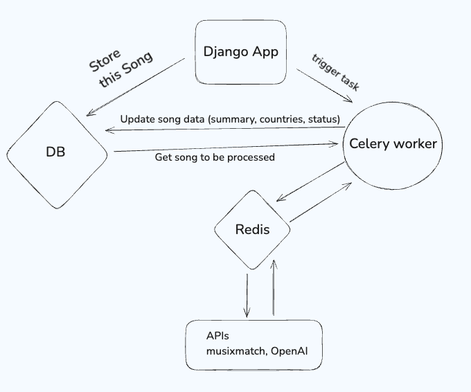

## Song summarizer

# Summary
A test interview project for pulling up song lyrics and extracting country mentions.

The main flow on the scheme

# Installation

- Install and use poetry
- Use python version - 3.11.^ (use pyenv to set specific version for the project)
- In Makefile there are some shortcuts
  - `make up` - to launch docker containers
  - `make stop` - to stop docker containers
  - `make test` - to run tests
  - `make install` - to install dependencies